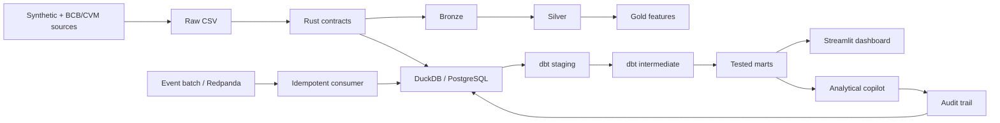

# FinBank Risk Lakehouse

[](https://github.com/DanielBBrasileiro/finbank-risk-lakehouse/actions/workflows/ci.yml)
[](https://github.com/DanielBBrasileiro/finbank-risk-lakehouse/actions/workflows/codeql.yml)
[](https://www.python.org/)
[](LICENSE)

FinBank is a local banking-risk data platform built to follow a dataset from ingestion to an analyst-facing product. Python handles ingestion, Rust validates source contracts, dbt builds the analytical layer, and Streamlit serves the results.

The default workflow runs on DuckDB and uses synthetic financial data, so it can be reviewed without cloud accounts or private datasets. PostgreSQL is covered in CI; AWS, Databricks and Snowflake are documented as extension paths.


## The Problem

Risk teams need the same customer, account, transaction and loan definitions across reports. FinBank turns those operational records into data products for:

- customer-level credit exposure and delinquency monitoring;
- account health and blocked-account analysis;
- daily transaction and suspicious-activity monitoring;
- current macroeconomic context alongside portfolio risk;
- analytical questions over documented marts, with SQL controls and an audit trail.

The pipeline rejects invalid batches before loading, reconciles source and mart totals, and can replay suspicious-transaction events without duplicating results.

## Architecture



The local lakehouse and the warehouse start from the same validated batch. One path materializes Bronze, Silver and Gold files; the other builds staging, intermediate and mart models with dbt.

See the detailed [architecture and deployment boundaries](docs/architecture_mermaid.md).

## Run Locally

Prerequisites: Python 3.12, `uv`, Rust/Cargo and Make. Docker is optional for the default DuckDB path.

```bash
git clone https://github.com/DanielBBrasileiro/finbank-risk-lakehouse.git
cd finbank-risk-lakehouse
cp .env.example .env
make bootstrap
make doctor
AI_DEMO_MODE=1 DB_TARGET=duckdb make demo-local
DB_TARGET=duckdb make run-dashboard
```

When the pipeline finishes, open [http://localhost:8501](http://localhost:8501). The generated dataset is deterministic, which makes reruns and test failures easier to compare.

## Implementation Status

| Capability | Status | Verification |
| --- | --- | --- |
| Python ingestion and deterministic fixtures | CI verified | pytest + DuckDB E2E |
| Rust input contracts | CI verified | Cargo tests + five CSV contract checks |
| Bronze, Silver and Gold Parquet layers | CI verified | layer tests + batch manifest |
| DuckDB warehouse and dbt marts | CI verified | `dbt build` |
| PostgreSQL warehouse | CI verified | service-container `dbt build` |
| Suspicious-event replay | CI verified | idempotency test |
| Streamlit dashboard | CI verified | health check + browser captures |
| Analytical copilot | CI verified | SQL policy, audit and offline eval tests |
| Dagster | Available locally | definition import test |
| Airflow | Available locally | container build + DAG smoke test |
| Redpanda | Optional | Docker Compose profile |
| AWS, Databricks and Snowflake | Blueprint | Terraform, notebooks and DDL |

## Data Products

| Product | Grain | Decision supported |
| --- | --- | --- |
| `mart_customer_exposure` | Customer | Exposure and current risk status |
| `mart_daily_transactions` | Date, channel, type | Volume and suspicious-activity monitoring |
| `mart_account_health` | Customer | Active, blocked and closed-account health |
| `mart_credit_macro_context` | Macro date, risk status | Current economic context by portfolio status |
| `mart_ai_copilot_audit` | Copilot interaction | Governance and operational review |

dbt covers source freshness assumptions, relationships, uniqueness, accepted domains, reconciliation and business rules. The macro mart adds context to the current portfolio snapshot; it is not a causal model. See the [business questions](docs/business_context.md) and [data dictionary](docs/data_dictionary.md).

## Analytical Copilot

The copilot can answer questions about project schemas, dbt models and documentation. Offline and configured-provider modes share the same controls:

- retrieval is limited to repository documentation, schemas and dbt assets;
- only one read-only `SELECT` or `WITH` statement is accepted;
- schemas and relations are allowlisted;
- destructive operations, comments and multi-statements are rejected;
- row limits are enforced;
- decisions, citations, SQL and responses are recorded;
- deterministic cases verify answers and refusals without a paid API.

It is an analysis aid, not a credit-decision model. The boundaries and failure behavior are documented in [AI governance](docs/ai_governance.md).

## Tests and CI

```bash
make test                 # Python tests
make coverage             # Full src coverage, minimum 70%
make lint                 # Ruff
make rust-test            # Rust unit tests
make sql-lint             # SQLFluff with dbt templating
make streaming-replay-test
make dashboard-smoke
make test-all
make evidence-pack
```

GitHub Actions runs separate jobs for code quality, the DuckDB demo, PostgreSQL integration, and infrastructure/security checks. Dependency updates, CodeQL, `pip-audit` and Terraform validation run in the repository as well.

## PostgreSQL

```bash
make up
DB_TARGET=postgres make generate generate-macro-offline generate-cvm-offline validate
DB_TARGET=postgres make load load-audit dbt
DB_TARGET=postgres make run-dashboard
make down
```

Loads preserve the schema and primary keys defined in `sql/postgres_bootstrap.sql`.

## Orchestration

The Make targets contain the executable pipeline logic. Dagster and Airflow orchestrate those commands instead of duplicating transformations. Airflow is optional and containerized under `orchestration/airflow`; Dagster definitions are available in `orchestration/dagster_defs.py`.

## Cloud Blueprints

Cloud examples are kept separate from the default local workflow:

- `infra/aws`: private, encrypted and versioned S3 lakehouse bucket blueprint;
- `databricks/notebooks`: Spark/Delta transformation patterns;
- `snowflake/ddl`: warehouse DDL and governance comments;
- `dbt/profiles.yml`: optional Snowflake target configuration.

See [cloud blueprint](docs/cloud_blueprint.md) for the intended boundaries and remaining work.

## Project Structure

```text
src/python_ingestion/   ingestion and warehouse loaders
src/rust_validator/     source data contracts
src/lakehouse/          local Medallion materialization
src/streaming/          event producer and idempotent consumer
src/ai_assistant/       retrieval, SQL policy, audit and evals
dbt/                    staging, intermediate, marts and tests
dashboards/             Streamlit serving layer
orchestration/          Dagster and optional Airflow
infra/                  cloud blueprints
tests/                  unit, integration and contract tests
docs/                   architecture, governance and portfolio evidence
```

## Limitations

FinBank is not a production banking system. It has not been load-tested at banking scale, does not process real customer data, and does not include regulated-model validation, production SLAs or a deployed managed-cloud environment.

Use the [pre-publication test plan](docs/portfolio/pre_linkedin_test_plan.md) and [demo walkthrough](docs/portfolio/demo_script.md) before presenting the release.

## License

[MIT](LICENSE)
