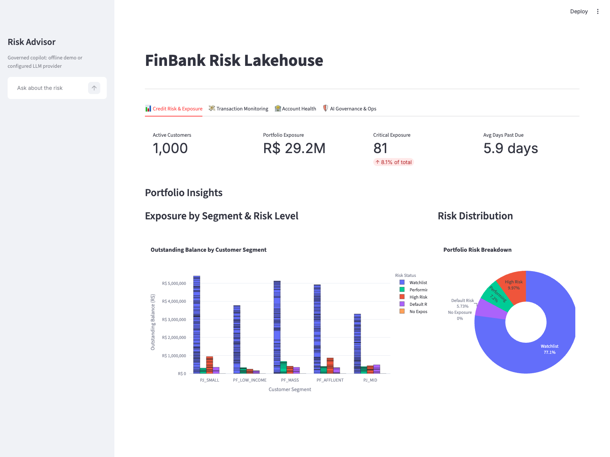

# FinBank Risk Lakehouse

[](https://github.com/DanielBBrasileiro/finbank-risk-lakehouse/actions/workflows/ci.yml)
[](https://github.com/DanielBBrasileiro/finbank-risk-lakehouse/actions/workflows/codeql.yml)
[](https://www.python.org/)
[](LICENSE)

A reproducible, local-first data engineering portfolio project for banking risk monitoring. It connects ingestion, data contracts, Medallion storage, analytics engineering, event processing, serving and governed AI in one testable workflow.

The project uses synthetic financial data only. AWS, Databricks and Snowflake assets are documented blueprints, not deployed-service claims.



## Business Outcome

FinBank turns operational customer, account, transaction and loan data into trusted products for:

- customer-level credit exposure and delinquency monitoring;
- account health and blocked-account analysis;
- daily transaction and suspicious-activity monitoring;
- current macroeconomic context alongside portfolio risk;
- governed analytical questions over documented marts.

This matters because risk decisions depend on consistent definitions, traceable lineage and rerunnable pipelines. The implementation treats contracts, idempotency, auditability and CI as part of the data product rather than presentation-only additions.

## Architecture


The Rust validator rejects invalid source batches before publication. The local lakehouse builds Gold from standardized Silver data, while dbt builds tested warehouse marts from the same validated batch.

See the detailed [architecture and deployment boundaries](docs/architecture_mermaid.md).

## One-Command Demo

Prerequisites: Python 3.12, `uv`, Rust/Cargo and Make. Docker is optional for the default DuckDB path.

```bash
git clone https://github.com/DanielBBrasileiro/finbank-risk-lakehouse.git
cd finbank-risk-lakehouse
cp .env.example .env
make bootstrap
make doctor
AI_DEMO_MODE=1 DB_TARGET=duckdb make demo-local
DB_TARGET=duckdb make run-dashboard
```

Open [http://localhost:8501](http://localhost:8501). The deterministic demo produces customers, accounts, transactions, loans, BCB/CVM fixtures, local Bronze/Silver/Gold artifacts, dbt marts, governed AI evaluations and an idempotent suspicious-event summary.

## What Is Proven

| Capability | Status | Automated evidence |
| --- | --- | --- |
| Python ingestion and deterministic fixtures | Integrated | pytest + DuckDB E2E |
| Rust input contracts | Integrated | Cargo tests + five real CSV validations |
| Bronze, Silver and Gold Parquet layers | Integrated | lakehouse tests + manifest |
| DuckDB warehouse and dbt marts | Integrated | `dbt build` in CI |
| PostgreSQL warehouse | Integrated | service-container `dbt build` in CI |
| Suspicious-event replay | Integrated | idempotency test |
| Streamlit serving | Integrated | health smoke test + visual evidence |
| Governed analytical copilot | Integrated | guardrail, audit and deterministic eval tests |
| Dagster | Optional local integration | definition import test |
| Airflow | Optional local integration | containerized DAG and config checks |
| Redpanda | Optional local integration | Docker Compose profile |
| AWS, Databricks and Snowflake | Blueprint | Terraform validation, notebooks and DDL |

## Data Products

| Product | Grain | Decision supported |
| --- | --- | --- |
| `mart_customer_exposure` | Customer | Exposure and current risk status |
| `mart_daily_transactions` | Date, channel, type | Volume and suspicious-activity monitoring |
| `mart_account_health` | Customer | Active, blocked and closed-account health |
| `mart_credit_macro_context` | Macro date, risk status | Current economic context by portfolio status |
| `mart_ai_copilot_audit` | Copilot interaction | Governance and operational review |

dbt includes source, relationship, uniqueness, domain, reconciliation and business-rule tests. The macro mart provides context; it does not claim causal impact. See the [business questions](docs/business_context.md) and [data dictionary](docs/data_dictionary.md).

## Governed AI

The analytical assistant is constrained by the same policy boundary in offline and configured-provider modes:

- retrieval is limited to project documentation, schemas and dbt assets;
- only one read-only `SELECT` or `WITH` statement is accepted;
- schemas and relations are allowlisted;
- destructive operations, comments and multi-statements are rejected;
- row limits are enforced;
- decisions, citations, guarded SQL and responses are audited;
- deterministic cases verify answers and refusals without a paid API.

The offline mode proposes governed SQL and explains trusted assets. It is not presented as an autonomous credit-decision system. See [AI governance](docs/ai_governance.md).

## Quality Gates

```bash
make test                 # Python tests
make coverage             # Full src coverage, minimum 70%
make lint                 # Ruff
make rust-test            # Rust unit tests
make sql-lint             # SQLFluff with dbt templating
make streaming-replay-test
make dashboard-smoke
make test-all
make evidence-pack
```

GitHub Actions separates code quality, DuckDB E2E, PostgreSQL integration and infrastructure/security checks. Dependabot, CodeQL, `pip-audit`, Terraform validation and pinned container versions cover public-repository hygiene.

## PostgreSQL Path

```bash
make up
DB_TARGET=postgres make generate generate-macro-offline generate-cvm-offline validate
DB_TARGET=postgres make load load-audit dbt
DB_TARGET=postgres make run-dashboard
make down
```

Loads preserve the schema and primary keys defined in `sql/postgres_bootstrap.sql`.

## Orchestration

The Make targets contain the executable pipeline logic. Dagster and Airflow orchestrate those commands instead of duplicating transformations. Airflow is optional and containerized under `orchestration/airflow`; Dagster definitions are available in `orchestration/dagster_defs.py`.

## Cloud Evolution

The cloud assets are intentionally separated from the verified local path:

- `infra/aws`: private, encrypted and versioned S3 lakehouse bucket blueprint;
- `databricks/notebooks`: Spark/Delta transformation patterns;
- `snowflake/ddl`: warehouse DDL and governance comments;
- `dbt/profiles.yml`: optional Snowflake target configuration.

No AWS, Databricks or Snowflake deployment is required to review the project. See the [cloud blueprint](docs/cloud_blueprint.md).

## Repository Guide

```text
src/python_ingestion/   ingestion and warehouse loaders
src/rust_validator/     source data contracts
src/lakehouse/          local Medallion materialization
src/streaming/          event producer and idempotent consumer
src/ai_assistant/       retrieval, SQL policy, audit and evals
dbt/                    staging, intermediate, marts and tests
dashboards/             Streamlit serving layer
orchestration/          Dagster and optional Airflow
infra/                  cloud blueprints
tests/                  unit, integration and contract tests
docs/                   architecture, governance and portfolio evidence
```

## Scope

This is a portfolio-grade local data platform, not a production banking system. It demonstrates engineering decisions and their verification, but does not claim production scale, regulated-model validation, managed-cloud operation, SLAs or causal credit-risk modeling.

Use the [pre-publication test plan](docs/portfolio/pre_linkedin_test_plan.md) and [recruiter demo script](docs/portfolio/demo_script.md) before presenting the release.

## License

[MIT](LICENSE)
