# FinBank Architecture

The local demo has one verified entry point: `AI_DEMO_MODE=1 DB_TARGET=duckdb make demo-local`.



The canonical diagram source is [`docs/diagrams/architecture-overview.mmd`](diagrams/architecture-overview.mmd). Render it from the repository root with:

```bash
npx -y @mermaid-js/mermaid-cli \
  -i docs/diagrams/architecture-overview.mmd \
  -o docs/portfolio/screenshots/architecture-overview.svg \
  --width 1800 --height 1200 --backgroundColor transparent
```

## Deployment Boundaries

| Component | Status | Evidence |
| --- | --- | --- |
| Python, Rust, local lakehouse, DuckDB, dbt, Streamlit | Integrated | `make demo-local` and CI |
| PostgreSQL | Integrated | CI service-container build |
| JSONL event replay | Integrated | Idempotency tests |
| Redpanda | Optional local integration | Docker Compose profile |
| Airflow | Optional local orchestration | Reproducible container and DAG smoke test |
| Dagster | Optional local orchestration | Importable asset definitions |
| AWS, Databricks, Snowflake | Blueprint | IaC, notebooks and DDL; no deployed-service claim |

Gold lakehouse artifacts and warehouse marts are two serving paths over the same validated source batch. They are not presented as a hidden cloud deployment.
